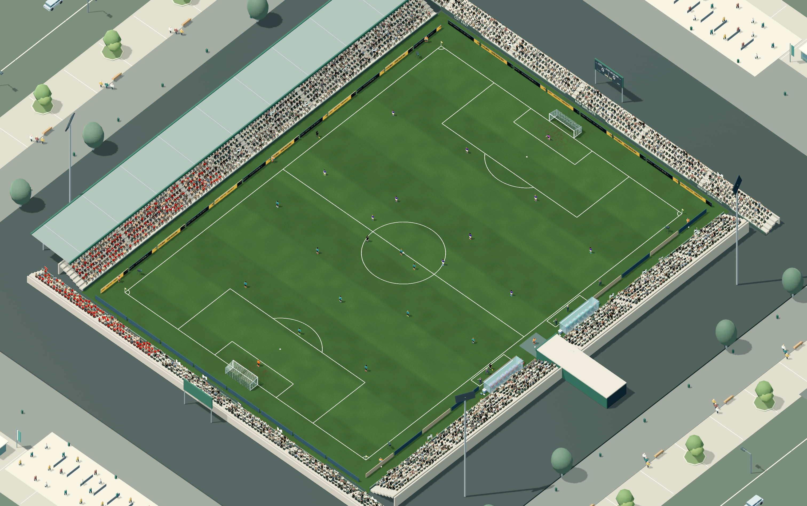
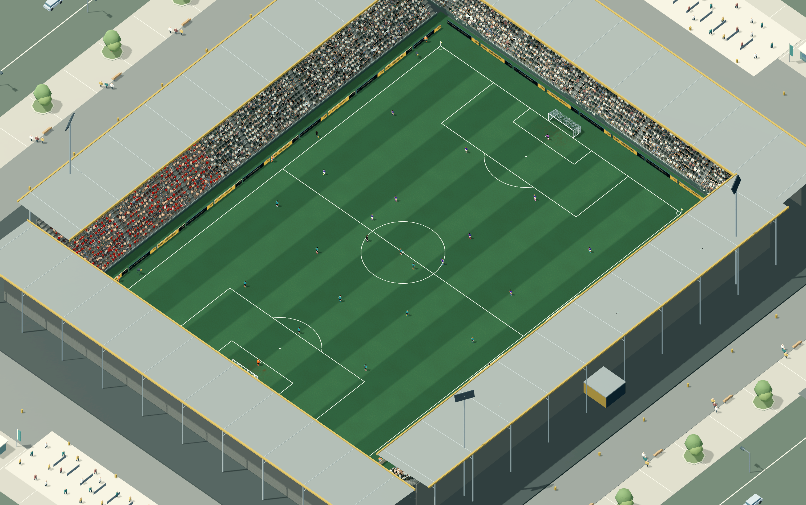
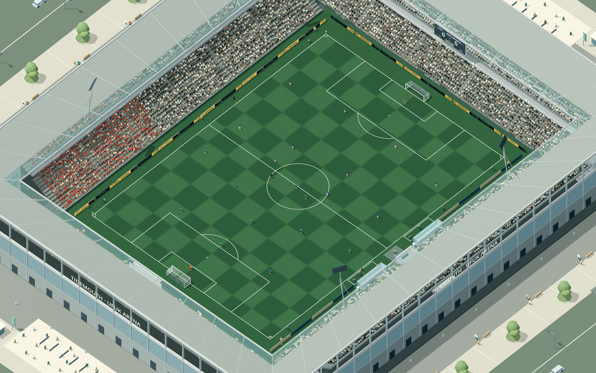
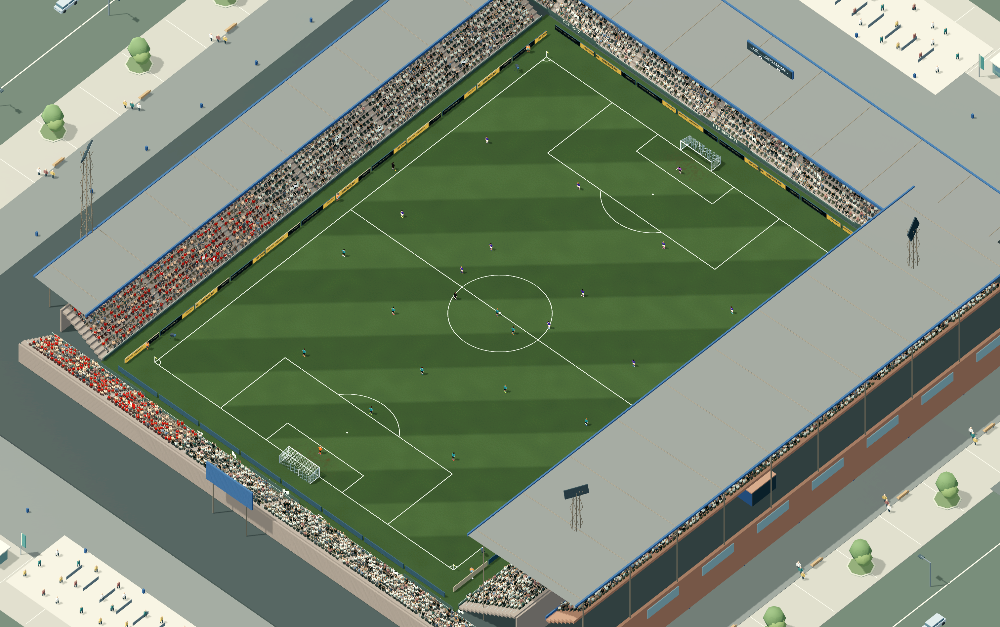

# Stada göre çim görünümü

Dört çim görünümü ev sahibinin kayıtlı stat kimliğine bağlıdır. Aynı kulüp her maçta aynı ton ve biçme genişliğiyle oynar. Aynı stat ailesini paylaşan kulüplerde küçük ton, şerit genişliği ve doğal renk dağılımı farkları vardır. Mevcut kariyer kayıtları yeni bir kayıt alanı gerektirmez.

| Stat | Desen | Görünüm |
|---|---|---|
| Şehir stadı | Geniş, yumuşak enine şerit | Sıcak yeşil, daha fazla doğal ton farkı ve kale ağzı aşınması |
| Kompakt stat | Dar boyuna şerit | Daha canlı yeşil, orta düzey bakım izi |
| Modern arena | Dama | Serin yeşil, düzenli ve daha bakımlı yüzey |
| Tarihi stat | Çapraz şerit | Zeytin yeşili, hafif yaşanmış yüzey |

## Görüntüler

### Şehir stadı



[Yakından](town-close.png) · [Yağmurlu gece](town-night.png)

### Kompakt stat



[Yakından](compact-close.png) · [Yağmurlu gece](compact-night.png)

### Modern arena



[Yakından](modern-close.png) · [Yağmurlu gece](modern-night.png)

### Tarihi stat



[Yakından](historic-close.png) · [Yağmurlu gece](historic-night.png)

## Uygulama ve kontroller

Çim ve beyaz saha çizgileri aynı desen, renk ve çim yatış yönü hesabını kullanır. Kamera uzaklaştığında desen kenarları piksel büyüklüğüne göre yumuşatılır. Ek geometri, doku veya ışık oluşturulmaz; mevcut iki malzemenin parametreleri maç başında değiştirilir.

Yağmur, çamur ve gerçek oyuncu temaslarının biriktirdiği aşınma katmanları korunur. Biçme deseni ve bakım izi yalnızca görseldir; topun sürtünmesi, sekmesi, oyuncu tutuşu, saha ölçüleri ve maç rastgeleliği değişmez.

Doğrulama: `pitch_variety_check` 27, `stadium_variety_check` 50, `weather_check` 19 kontrol; hepsi geçti. Grafik koşusunda 12 gündüz/gece/yakın görüntü kaydedildi. `wet_turf_shader_check` kuru görüntü ve yağmur geçişlerini gerçek grafik ortamında hatasız tamamladı.

```sh
godot --headless --path . --script tests/pitch_variety_check.gd
godot --path . --script tests/pitch_variety_check.gd -- --visual
godot --path . --script tests/pitch_variety_benchmark.gd
```

## FPS karşılaştırması

Apple M4 Pro, Godot 4.7.2 Mobile / Metal 4, 1440×900, 120 Hz fizik. Dört statta yağmurlu gece canlı maçı ölçüldü. Aynı mimariyle önceki ve yeni çim/çizgi shaderları karşılaştırıldı; çalışma sırası dönüşümlüydü. Isınmadan sonra her örnekte 1,5 saniye beklenip 5 saniyelik oyun ölçüldü. FPS ölçümü sırasında başka oyun testi çalıştırılmadı.

| Stat | Önce FPS | Sonra FPS | Önce p95 | Sonra p95 |
|---|---:|---:|---:|---:|
| Şehir stadı | 119.81 | 119.89 | 9.44 ms | 9.23 ms |
| Kompakt stat | 119.46 | 120.01 | 9.20 ms | 9.06 ms |
| Modern arena | 119.66 | 119.90 | 11.48 ms | 9.40 ms |
| Tarihi stat | 119.72 | 119.70 | 9.10 ms | 9.17 ms |

Bu cihazdaki örneklerde belirgin bir FPS gerilemesi görülmedi. Sunum yaklaşık 120 FPS'de kaldığı için sonuç sınırsız GPU kapasitesini göstermez; GPU zaman sayacı bu sürücüde veri vermedi. [Ham sonuçlar](performance.json).
