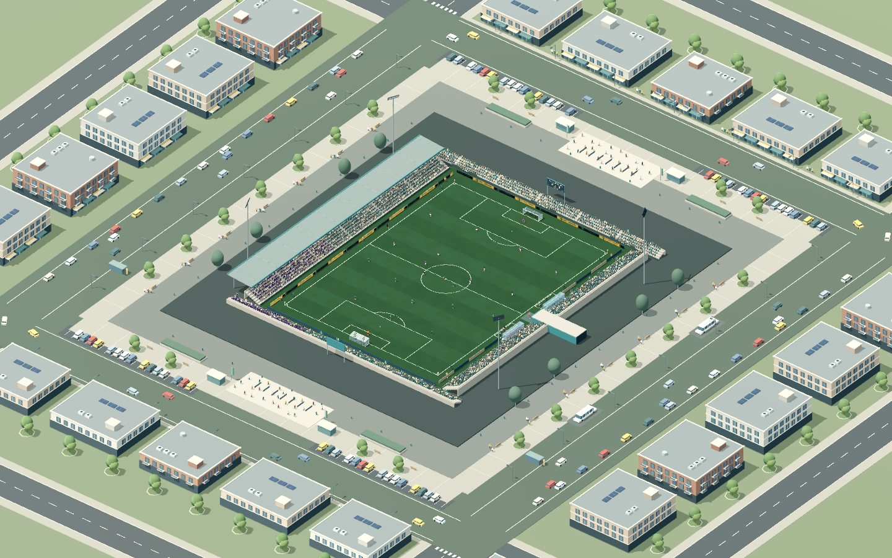
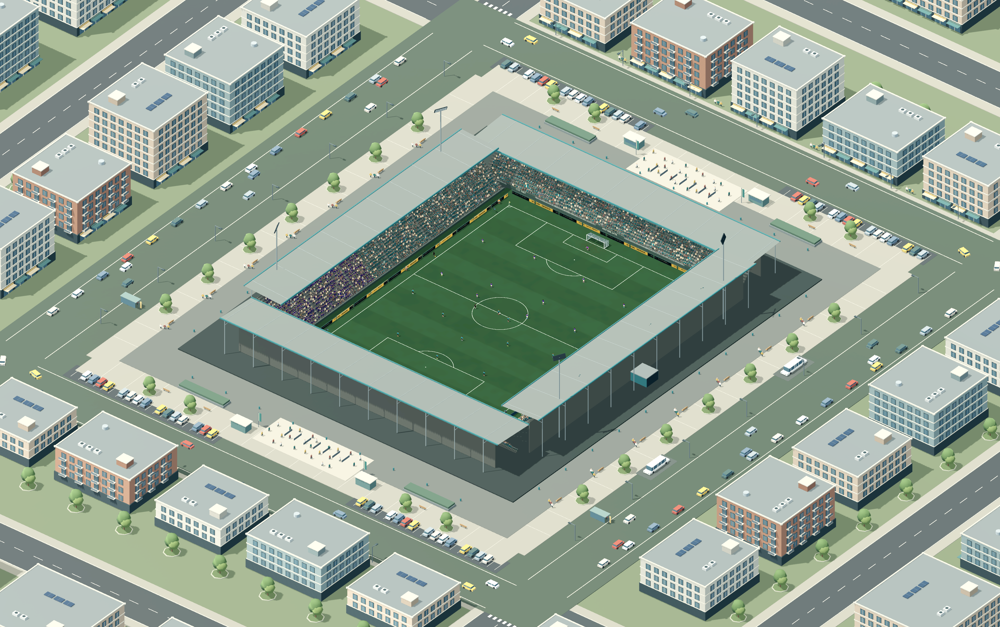
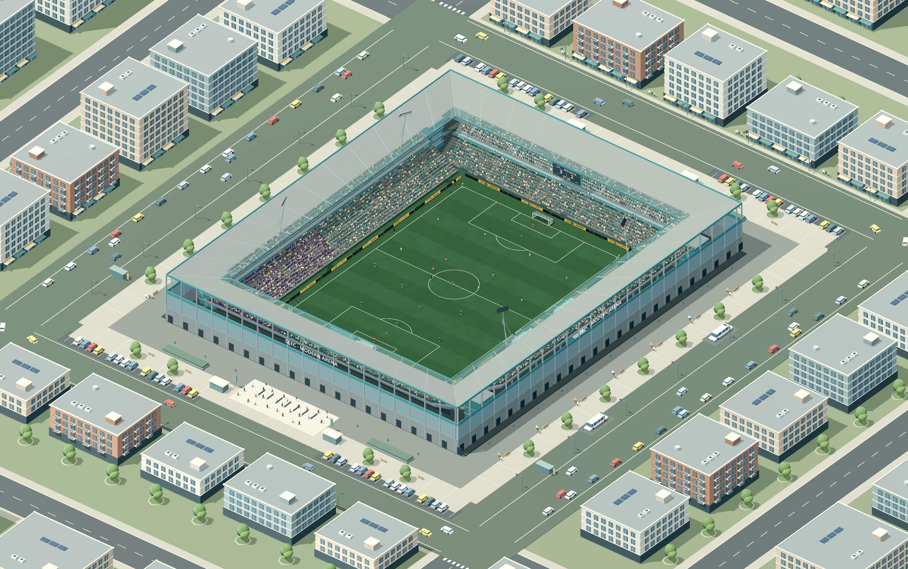
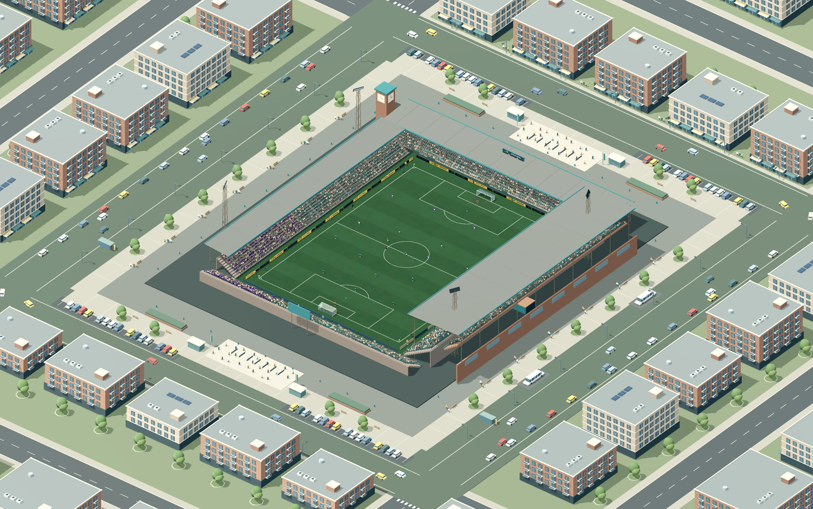

# Kulübe ait dört stadyum

110 kulüp dört mimari aileyi paylaşır. Her kulübün kaydedilen bir stat adı ve tipi vardır; kulüp renkleri koltuklara, taraftarlara ve çatı kenarlarına yansır. Mevcut kariyer kayıtları otomatik tamamlanır. Lig yükselmesi veya itibar değişmesi stat atamasını değiştirmez.

Kariyerde deplasmana gidildiğinde fikstürdeki gerçek ev sahibinin stadı açılır. Hızlı maçta sol taraftaki kulüp ev sahibidir. Takım seçimi ve maç öncesi kadro ekranı stat adını gösterir.

| Mimari | Ayırt edici görünüm | Atanan kulüp |
|---|---|---:|
| Şehir stadı | Alçak açık tribünler, tek kapalı yan tribün, ağaçlar ve alçak mahalle | 18 |
| Kompakt stat | Dört dik ve kapalı tribün, açık köşeler | 44 |
| Modern arena | İki katlı tribünler, kesintisiz çatı ve camlı cephe | 14 |
| Tarihi stat | Asimetrik tribünler, yüksek doğu galerisi, tuğla cephe ve saat kulesi | 34 |

## Galeri

### Şehir stadı



[Maç görünümü](town-match.png) · [Yağmurlu gece](town-night.png)

### Kompakt stat



[Maç görünümü](compact-match.png) · [Yağmurlu gece](compact-night.png)

### Modern arena



[Maç görünümü](modern-match.png) · [Yağmurlu gece](modern-night.png)

### Tarihi stat



[Maç görünümü](historic-match.png) · [Yağmurlu gece](historic-night.png)

[Stat adı: takım seçimi](team-selection.png) · [Stat adı: kadro ekranı](prematch.png)

## Performans

2026-09-28, Apple M4 Pro, Godot 4.7.2, Mobile / Metal 4, 1440×900, 120 Hz fizik. Her statta gündüz, gece ve yağmurlu gece için 1,5 saniye yerleşme ardından 5 saniye canlı oyun ölçüldü. Her örnekte en az 594 oynanan kare var. FPS testi sırasında başka oyun testleri çalıştırılmadı.

| Stat | Gündüz FPS | Gece FPS | Yağmurlu gece FPS | p95 kare süresi |
|---|---:|---:|---:|---:|
| Şehir stadı | 120.00 | 120.00 | 120.02 | 8.95–9.01 ms |
| Kompakt stat | 119.81 | 120.01 | 119.85 | 8.96–9.15 ms |
| Modern arena | 120.00 | 120.00 | 119.81 | 8.97–9.15 ms |
| Tarihi stat | 120.01 | 120.00 | 118.77 | 8.97–9.18 ms |

Değişiklik öncesindeki tek stat ölçümleri 119,83–120,03 FPS idi. Bu cihazdaki koşulda belirgin bir FPS gerilemesi görülmedi. macOS sunumu yaklaşık 120 FPS'de kaldığı için bu ölçüm sınırsız GPU kapasitesini göstermez; GPU zaman sayacı bu sürücüde veri sağlamadı. Daha düşük p95 değerlerini doğrudan stat sisteminin hız kazancı olarak yorumlamıyoruz.

[Önceki ham ölçümler](before-fps.json) · [Dört stat ölçümleri](after-fps.json) · [Geometri ve oluşturma süreleri](geometry.json)

Sadece bir tribün/çevre modeli yüklüdür. Aynı mimaride başka kulübe geçerken geometri yeniden kurulmaz; adlar ve renkler güncellenir. Mimari değişiminde önceki model kaldırılır. Bu cihazda farklı mimari oluşturma maliyeti maç başlangıcında yaklaşık 0,4–1,35 saniyedir. Maç içinde stat oluşturulmaz. Dört gölgeli ışık sınırı ve mevcut geometri birleştirmesi korunur.

## Doğrulama

- `stadium_variety_check`: 50 işlevsel kontrol; grafik koşusunda ayrıca 15 görüntü kaydı. Kulüp atamaları, kayıt dönüşümü, eski kayıtlar, klonlanan kulüpler, aynı fizik nesnelerinin korunması, tek aktif model, skor tabelaları, yağmur/gece geçişi, antrenman ve kariyer deplasmanı.
- `stadium_atmosphere_check`: 26; `match_character_check`: 41; `crowd_check`: 26.
- `district_check`: 9; `match_lighting_check`: 22; `render_integrity_check`: 8 (gerçek GPU taraftar/koltuk verileri).
- `career_cups_flow_check`: 28; `pitch_space_check`: 31.

Saha testindeki eski sabit top yarıçapı mevcut ortak ölçüye bağlandı; bek genişliği denemesi kayıtlı 3-5-2/dar taktikten bağımsız 4-4-2 ve nötr genişlikle çalıştırılıyor. Oynanış kodu bu düzeltme için değiştirilmedi.

```sh
godot --headless --path . --script tests/stadium_variety_check.gd
godot --path . --script tests/stadium_variety_check.gd -- --visual
godot --path . --script tests/stadium_performance_benchmark.gd
```
